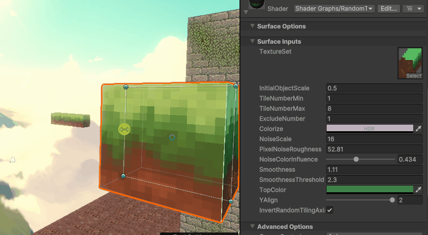
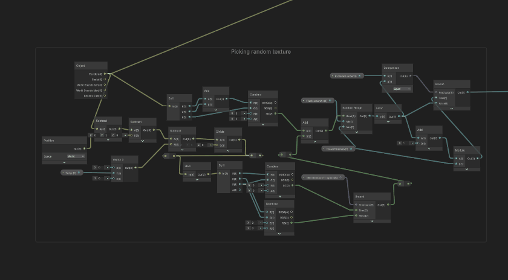

# "Slimebound" PC game 

## Introduction
"Slimebound" is the platforming game based on [Fez](https://store.steampowered.com/app/224760/FEZ/) with its own orginal implementation of changing dimension axis mechanic.     
Project has been created in Unity 6 (6000.0.23f1) with Univeral Render Pipeline.

---
## Authors
- [DarknessoPirate](https://github.com/DarknessoPirate)
- [HAScrashed](https://github.com/HAScrashed)
- [Robert Pintera](https://github.com/RobertPintera)

---
## Features
- **Change axis of movement**: Is it 2D game or 3D game then?
- **Platforming movement system**: Our own movement system
  - **Wall-jumping**
  - **Wall-sliding**
  - **Coyote handling**
  - **Dashing**
- **Custom made shaders**: Project features shaders made in Unity Shadergraph.
  - *RandomTextureFromTilesForBlockChucks*: Shader capable of automatic tiling of textures + random picking of texture from tile-set with addition of pixel noise and self-defined glossiness.
- **Slimy animations and graphics**: All with addition of nice sounds.
- **Multiple levels to beat**: Beat them all and easily intergrate new ones.

---
## Technologies Used
- **C#** - Programming language
- **Unity** - Graphics Engine
- **Shader Graph** - Graphical node-based editor for shaders
- **Aseprite** - Pixel art software for image & animation creation
- **Blender** - 3D modelling software
  
---
## Media
- **Change movement axis**
  

- **Movement system**
  

- **Autmated random & tiling shader**

---
## How to use
1. Clone this repository
2. Open the project in Unity.
3. Install missing packages - [Midgard Skybox](https://assetstore.unity.com/packages/2d/textures-materials/sky/midgard-skybox-273733?srsltid=AfmBOoqP3S140YyvE5kD8pIu3dOXUw68yvHKqdWrM8dp6tjdJhRuc4y8) & [FREE Skybox Extended Shader](https://assetstore.unity.com/packages/vfx/shaders/free-skybox-extended-shader-107400?srsltid=AfmBOopqa3qULnMYJAMo5BwzXAv2pAsBaOWTrvb94sIOsdTvnfDarZYf) from Unity Asset Store

---
## How to play
- **A, D** to move left right
- **Q, E** to change perspective
- **Spacebar** to jump, double jump and wall-jump
- **Shift** to dash

---
## License
- MIT license

---
For any questions, feel free to reach out!
